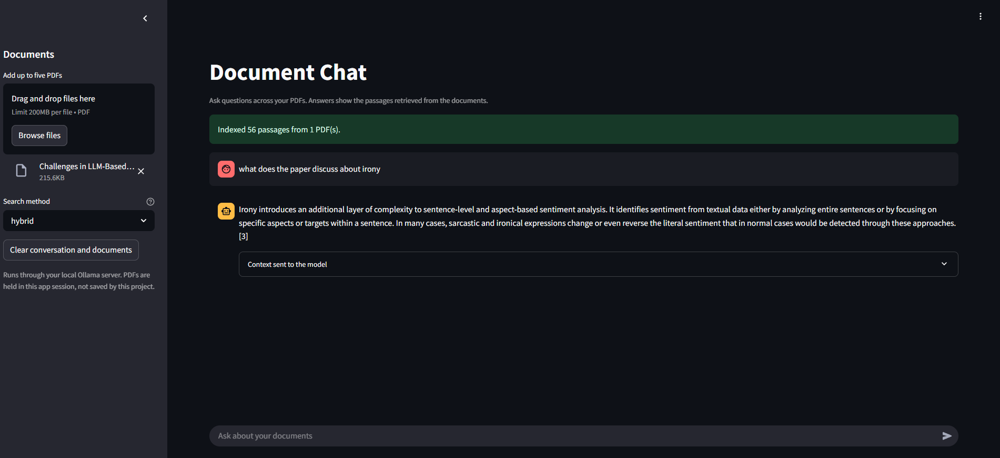

# Document Chat

A local Streamlit app for asking questions about up to five text-based PDFs. Everything runs on your machine: [Ollama](https://ollama.com/) provides the embedding and chat models, and an in-memory [Chroma](https://www.trychroma.com/) index stores the vectors. Every answer is shown with the exact passages (file and page) that were sent to the model.



## Quick start

1. Install Python 3.11 or newer and Ollama.
2. Create and activate a virtual environment: `python -m venv .venv`.
3. Install dependencies: `pip install -r requirements.txt`.
4. Pull the models: `ollama pull llama3.2` and `ollama pull nomic-embed-text`.
5. Make sure Ollama is running, then start the app: `streamlit run app.py`.
6. Upload PDFs in the sidebar, pick a search method, and ask questions.

## Project structure

| File | Purpose |
|------|---------|
| `app.py` | Streamlit user interface: upload, search method, chat, and the "Context sent to the model" panel. |
| `document_chat/` | Active RAG package, split by responsibility (details below). |
| `config.py` | Model names and limits (file size, chunk size, top-k, similarity threshold). |
| `evaluate.py` | Command-line retrieval evaluation (hit@6 and MRR@6). |
| `evaluate_sentiment.ipynb`, `eval_cases.sentiment.json` | A worked evaluation: 24 page-labelled questions about one paper, run through the real pipeline. |
| `tests/test_core.py` | Unit tests for chunking, BM25, rank fusion, citation formatting and answer validation. |
| `EXPLAINER.md` | Study guide: every concept, function and design trade-off, written for explaining the project. |
| `requirements.txt` | Python dependencies. |

The active pipeline is organized as:

```text
document_chat/
  models.py       Shared Chunk, Hit, and AnswerResult data models
  ingestion.py    PDF validation, text extraction, and page-aware chunking
  retrieval.py    Tokenization, BM25, and reciprocal rank fusion
  answers.py      Source formatting and structured-answer validation
  index.py        Chroma index lifecycle, search orchestration, and LLM answering
  __init__.py     Public package API
```

Local-only folders, ignored by git: `data/`, `chroma_db/`, and the root-level `ingest/` plus `rag/` folders. Those two root folders contain an earlier LangChain implementation (MMR, multi-query and RAG-Fusion retrievers) and are retained for reference; the active app uses `document_chat/`.

## How it works

```
PDFs -> validate -> extract text per page -> chunk -> embed -> Chroma + BM25 index
Question -> retrieve top results -> LLM (JSON output) -> validate -> answer + citations
```

1. **Ingestion.** Each PDF must start with the `%PDF-` header, be at most 10 MB, unencrypted and at most 150 pages; at most 5 files are accepted. Text is extracted page by page with `pypdf`, in memory. A PDF without a text layer produces a warning, since there is no OCR.
2. **Chunking.** Each page is split into chunks of about 1400 characters with a 200-character overlap, cutting at word boundaries. Chunks never cross pages, so each one keeps its file name and page number. Chunk IDs include a content hash, so replacing a file with the same name is re-indexed.
3. **Indexing.** Chunks are embedded in batches of 32 with `nomic-embed-text` and stored in an ephemeral Chroma collection using cosine distance. A BM25 keyword index (k1 = 1.2, b = 0.75) is built over the same chunks. Nothing is written to disk, and the collection is deleted when the documents change or the conversation is cleared.
4. **Retrieval.** The sidebar offers three search methods:
   - **Hybrid** (default): merges the semantic and BM25 rankings with reciprocal rank fusion (k = 60), so both exact terms and meaning count.
   - **Semantic**: embedding similarity only.
   - **Keyword**: BM25 only.

   About 18 candidates are fetched and the top 6 kept. For semantic and hybrid search a passage needs cosine similarity of at least 0.25 unless BM25 also found it.
5. **Prompt construction.** The top `TOP_K` retrieved passages are labelled `SOURCE_ID=source_N`, `FILE`, `PDF_PAGE` and `TEXT`, then passed to the model. `source_N` IDs cannot be confused with page numbers or bibliography numbers inside the text.
6. **Generation.** `llama3.2` runs at temperature 0, capped at 500 output tokens. The prompt says to answer only from the excerpts and to treat them as untrusted data (a mitigation against prompt injection, not a guarantee). Ollama constrains the reply to a JSON schema with `status`, `answer` and `citations`.
7. **Answer validation.** The reply is parsed and checked strictly. The app abstains ("I could not find enough evidence...") if the JSON is malformed, the status is `insufficient_evidence`, the answer is empty or contains `[n]` markers, or any citation is missing, is not of the form `source_N`, or points past the supplied excerpts. Valid citations are shown as `[n]` after the answer. This checks structure only; it does not prove that each cited passage supports every claim.
8. **Sessions.** The index lives in the Streamlit session. Removing or replacing PDFs discards it, and the "Clear conversation and documents" button resets everything.

## Configuration

Edit `config.py` to change the chat or embedding model, file and page limits, chunk size and overlap, `TOP_K`, and `MIN_COSINE_SIMILARITY`. If the app abstains too often, try lowering `MIN_COSINE_SIMILARITY` or using a larger chat model.

## Evaluation

`evaluate.py` measures whether the labelled page appears in the top 6 results (hit@6) and the mean reciprocal rank (MRR@6). Provide a JSONL file with one case per line; `page` is one-based and `source` is the PDF filename:

```json
{"question":"What is the main finding?","source":"example.pdf","page":2}
```

```
python evaluate.py example.pdf --cases cases.jsonl --method hybrid
```

Run it with `hybrid`, `semantic` and `keyword` on the same cases to compare them, and include answerable, unanswerable and exact-term questions. `evaluate_sentiment.ipynb` shows a complete example. Retrieval metrics alone do not show that answers are faithful; check citations against the source passages separately.

### Sentiment-paper evaluation (single PDF)

The notebook evaluation used **one 21-page PDF**, *Challenges in LLM-Based Sentiment Analysis*, with **24 manually labelled questions**. It compares whether the expected source page appeared among the six retrieved passages; this is a small, single-document experiment, not evidence of performance across multiple PDFs or domains.

| Retrieval method | Hit@6 | MRR@6 |
|------------------|------:|------:|
| Hybrid | 24/24 (1.000) | 0.797 |
| Semantic | 23/24 (0.958) | 0.758 |
| Keyword (BM25) | 22/24 (0.917) | 0.699 |

In this run, hybrid retrieval ranked the labelled page in the top six for all 24 questions and had the highest MRR. The notebook's saved run predates the current change to send retrieved top-k passages directly to the model, so its answer-generation and context-selection results are not reported as results for the current pipeline. Rerun the notebook to measure the current end-to-end answer behavior.

Run the unit tests with `python -m unittest discover tests`.

## Limits

This is a local research prototype. It has no OCR, authentication, access control or claim-level faithfulness check. PDFs are uploaded to the local Streamlit server and held in memory for the session; do not expose that server to other users, and do not upload confidential or patient data to a shared instance.
